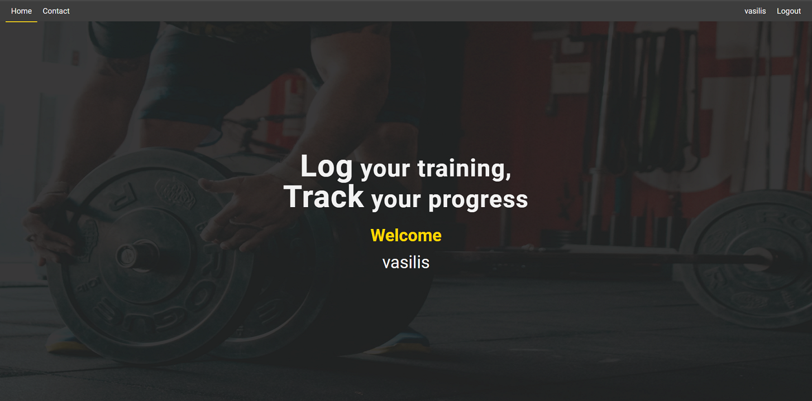
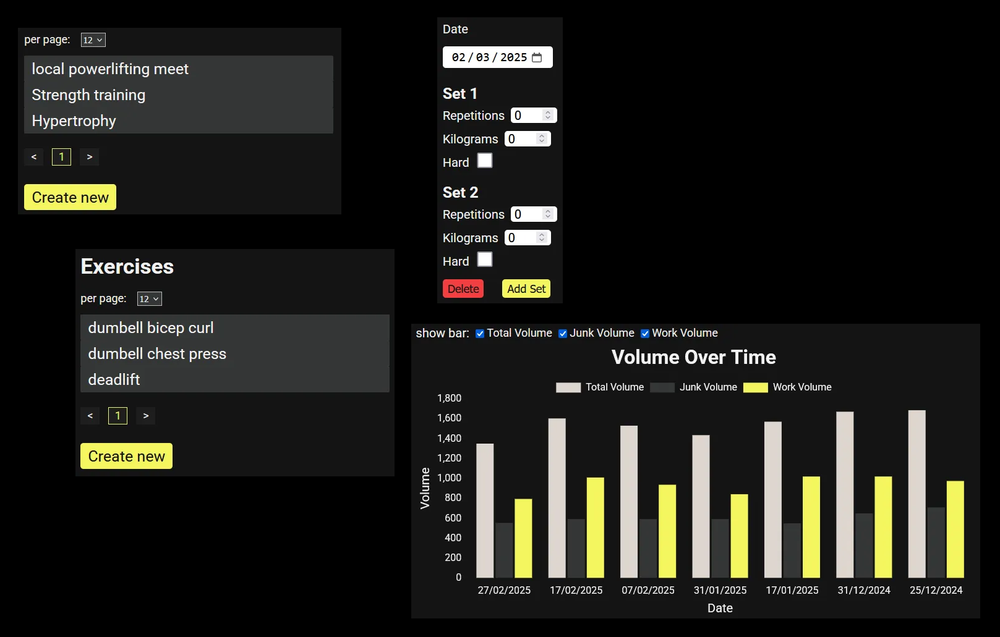

# WORKOUT TRACKER

Visit the website [here](https://www.workouttrackr.com/)

### A Workout Tracker

This app is created with reactjs, expressjs and mongoDB. It is a workout tracker. Currently you can track weightlifting volume, pace and speed.

It includes the following:

- GET/POST/PUT/DELETE routes
- RTK query from Redux Toolkit for fetching and handling data
- Admin functionality
- JWT for authentication
- Authorization
- Captcha protection on registration with Cloudflare
- Reset password functionality with Postmark email service
- React-hook-form for the forms and JOI for frontend and backend validation
- Data visualization with react-chartjs-2
- Pagination with react-paginate
- Slugified URLs
- Some web security stuff: html sanitization, Helmet for setting HTTP response headers

